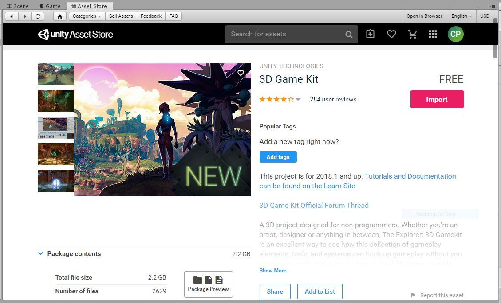

# VandyHacks Unity HackPack

## Table of Contents
1. Introduction  
    1.1 Why Unity?  
    1.2 Vocabulary  
2. Installation and Setup  
    2.1 Download  
    2.2 Set Up Unity via Unity Hub (All Platforms)
3. Unity Tour  
    3.1 Adding a Simple Object  
    3.2 The Basic Windows  
    3.3 Importing Custom Assets and Creating C# Scripts
4. 3DGameKit and 3D Platformer Example  
    4.1 Setting Up 3D GameKit  
    4.2 Loading the Example Game  

# 1. Introduction
**Unity** is a game engine. This specific game engine is a high-level development environment that allows for the creation of games and graphical applications with a minimum amount of code or backend knowledge. Unity allows you to focus on the important parts of your experience - game design, interaction logic, and visual design - while handling all of the graphical backend stuff for you. That means that instead of spending two days writing C++/OpenGL code to get a textured cube on the screen, you can simply drag and drop a created one from a folder menu.

This guide is authored by Conner Pinson on behalf of the VandyHacks organizational board. It is meant as an entry point for absolute beginners and combines lessons from different tutorials (linked in `1.2.1`) as well as my own thoughts and explanations. The purpose of this pack is pool all relevant resources for beginners into one place so that you have an easy jumping off point for the hackathon. If you have an intermediate or advanced understanding of Unity or other game engines, this guide may not be for you, but I still invite you to check it out.

## 1.1 Why Unity?
There are a multitude of high-level game engines available for free to hobbyists and students. Some popular ones include:
1. **Unreal Engine** (*Fortnite*, *Gears of War*, *Yoshi's Crafted World*) - Most comparable to Unity, low barrier to entry with capabilities to make AAA-level games
2. **Godot** (Open Source game engine) - Open source alternative that has a robust 2D engine and a blossoming 3D one
3. **CryEngine** (*Cysis*, *Prey* (2017), *Kingdom Come: Deliverance*) - Known for stellar graphical capabilities
4. **Amazon Lumberyard** (*Star Citizen*, *New World*) - Newer game engine focused on Twitch integration and online multiplayer capabilities
5. **RPG Maker** - Simple game engine for making classic *Final Fantasy*-like games

Popular games made with Unity include *Inside*, *Ori and the Blind Forest*, *Hearthstone*, *Rust*, *Wasteland 2*, and *Kerbal Space Program*. An important feature of Unity (especially for games like *Hearthstone*) is that games are easily portable across devices. Unity games can be ported to Switch, Xbox One, PC, Mac, Linux, PS4, Oculus Rift, Vive, Android phones, iOS devices, and [more](https://unity3d.com/unity/features/multiplatform). This, along with its relative ease-of-use, makes it an ideal entry point for beginner developers who are looking to ship cross-platform.  

Unity is also friendly to developers who may be lacking artistic skills or any kind of artistic team. This is thanks to perhaps Unity's greatest strength: **The Unity Asset Store**. The asset store offers hundreds of free models, texture packs, and level designs to use in your games. You, of course, are not restricted to this store and can import custom works from other programs at any time. However, even for professional projects, this can allow for quick prototyping while programmers are waiting on finalized assets from the art team. For hobbyist productions, they could even end up being in your games! (Just don't become an asset-flipping studio like [Digital Homicide Studios](https://en.wikipedia.org/wiki/Digital_Homicide_Studios)).

## 1.2 Vocabulary
The following vocabulary will be good to know for absolute beginners getting started with Unity. If you have some experience with Unity, feel free to read this for a refresher or skip on to section 2.

* **Game Engine** - A game engine is the software that provides game creators with the necessary set of features to build games quickly and efficiently. Allow developers to easily combine scripts, objects, sprites, and art from other programs into playable media.
* **C#** - Scripting language that is used to write logic to objects in Unity
* **Integrated Development Environment** (IDE) - An environment to write and run code that offers syntax highlighting and other assistive features like autocomplete. Much better than writing code in Notepad.
* **Unity Hub** - A management tool that allows you to manage different projects and versions of Unity from a single window
* **Asset** - Assets can be a multitude of things from 3D models, texture maps, audio, animations, etc. Essentially they are any object that combines with others to create the user experience
* **Scene** - Think of each Scene file as its own individual level in your game. Scenes contain all the vital information for your game's levels and menus
* **GameObject** - The fundamental objects in Unity that represent characters, props and scenery. They do not accomplish much in themselves but they act as containers for Components, which implement the real functionality.
* **Component** - The "nuts and bolts" of your standard GameObject. Adds logic and interaction properties to GameObjects
* **Prefab** - You can save GameObjects and their constituent Components into Prefabs which can then be duplicated and placed anywhere in your game without the need to recreate the GameObject from scratch.

### 1.2.1 Useful Links/My Sources:
* [Documentation for Unity 2019](https://docs.unity3d.com/Manual/UnityManual.html) (Free)
* [Official Tutorials](https://learn.unity.com/) (Free)
    * [Roll-a-ball](https://learn.unity.com/tutorial/introduction-to-roll-a-ball?projectId=5c51479fedbc2a001fd5bb9f) - Good starter tutorial
* [Udemy](https://www.udemy.com/) - Full featured online courses (Premium)
* [Humble Bundle](https://www.humblebundle.com/) - The Book Bundle and Software Bundle often offers Unity/game dev instructional books and courses for very cheap, proceeds go to charity (Premium)

# 2. Installation and Setup
Installation of Unity is very straight forward. However, there are a couple options for what sort of Unity install we would like. Here I will lay out the options but we will be using the new **Unity Hub** for Unity version management and install.

## 2.1 Download
### PC Instructions
Go to the [Unity download page](https://unity3d.com/get-unity/download). Here you will see the option to choose a specific version of Unity and download that specific version, or to download the Unity management software Unity Hub. We will choose Unity Hub.  

After the download is complete, run the `.exe` setup file. Accept the license agreement and choose an install path that is appropriate for your machine (an SSD would be nice of course).  

### Mac Instructions
Follow the instructions for PC. Unity's website should get you the `.dmg` file for Mac. Double click it and accept the defaults like you would on PC.

### Ubuntu Instructions
Unity for Linux has recently hit a public release, finally making Linux as viable a platform for Unity game dev as Mac or PC. 

Download the AppImage file for Unity Hub from [this link](https://public-cdn.cloud.unity3d.com/hub/prod/UnityHubSetup.AppImage). Right click the file in the file manager, go to Properties, and check the box allowing the file to run as an executable. Or, from the terminal, run `chmod +x [file path]` to get the same result. Run the file, agree to the license, and click "Yes" to integrate the app into your application launchboard.

Honestly if you're on another Linux distro, oof. Unity currently only supports Ubuntu-based distributions. Check out [this StackOverflow post](https://askubuntu.com/questions/1077816/how-to-install-unity3d-on-ubuntu-18-04) and [this Unity dev thread](https://forum.unity.com/threads/unity-on-linux-release-notes-and-known-issues.350256/) and you should be able to figure out how to install the unofficial version for other distros.

## 2.2 Set Up Unity via Unity Hub (All Platforms)

After Unity Hub is installed, run the program. You will be taken to a screen that says you have no active license. You will need to log in with a Unity ID in order to activate a new license for Unity Personal. Click on the picture of the little dude on the top right to sign into an existing account or to create a new one.

After being taken back to the main screen, click "Activate a New License". On **License Agreement**, choose Unity Personal and the option that says "I do not use Unity in a professional capacity. Hit "Next" and you will have your new license instituted!

Click the **Back** arrow on the top left and return to the Home Screen. Choose **Installs**. Click **Add** on the top right and choose the latest release of Unity. Click **Next** and you will be prompted to choose what sort of build support you would like to add to your install. I would recommend at least adding Windows/Mac/Linux build support. If you are planning on creating a mobile game, Android and iOS build support is also available. Towards the bottom there are also different language packs if you would like to use Unity in languages other than English. I would also recommend leaving **Visual Studio Community** checked to install. This will give you a convenient IDE for your C# code. Click **Install** to finally begin installing Unity itself. After this, you have Unity installed on your machine and ready to go!

I would recommend pinning Unity Hub to the taskbar or to the desktop and not the specific version of Unity you've installed. You can create projects in this window and it will launch the appropriate instance of Unity for you.

You may ask, why all this trouble for Unity Hub? Why would we need to install all these different versions of Unity? Well to take an example from my life, someone on my team wanted to reuse a project he had made in Unity 2018. We wanted to port this project to a computer that only had Unity 2019. He spent a week trying to get everything to play nice with the new updates before he finally broke down and just installed Unity 2018 on the new computer. If Hub had been installed, it could have easily downloaded and kept both environments separated for you.

# 3. Unity Tour

Open up the **Unity Hub** and on the **Projects** tab click **New** and on the next screen, choose **3D** and name your project whatever you would like. Choose a file path to store the project. A good file directory structure is to have all Unity projects in folders underneath one folder. For example, I usually work off an external drive, `J:\`, on Windows. So I have a folder `J:\Unity\` that then has a folder underneath for each individual project. In this case, I've chosen `J:\Unity\VandyHacks Unity Hackpack`.


## 3.1 Adding a Simple Object

For demo purposes (and to show how easy it is to add rudimentary geometric objects), go to the **GameObject** menu on the top and mouse over **3D Object** and choose **Sphere**. This will create a sphere at coordinate (0, 0, 0) in your example scene in the center panel. Unity show automatically select the object and its properties will show up in the **Inspector** tab to the right.


## 3.2 The Basic Windows
### 3.2.1 The Scene View
Roughly in the center of the default layout should be the game scene where your sphere appeared when you created it. This is the **Scene** and it is where you will see your beautiful game in progress. In this view you can see important abstract game objects such as lights and cameras. You can also select objects and get orientation details (the positions of the x, y, and z axes in comparison to that of the scene itself).

Think of a **Scene** as a single level in your game.

### 3.2.2 The Game View
If you click at the top of the Scene view and choose **Game** you will see a representation of what your game will look like to an actual player. Right now you just see your sphere but eventually you will be able to see your full-fledged level in engine!

### 3.2.3 The Inspector
If it isn't selected, click on the sphere in the **Scene** view. This will once again populate the right hand window with the details of the object you've selected. Some important points are **Transform** where you can manually change the position, rotation, and scale of your object. Feel free to play around with all the setting in the **Inspector** and see what happens! (Note you can also click and drag objects on the Scene view.)

### 3.2.4 The Assets Panel
The **Assets** Panel is the file directory that contains all of the custom or downloaded assets that you will use in your game. Whether it's a tileset for a 2D dungeon, a 3D model for a bird in the background of an adventure game, or a texture to wrap around a box, it'll be here.

### 3.2.5 Hierarchy
The **Hierarchy** has each GameObject listed split up by which Scene it is in.


### 3.2.6 The Unity Asset Store
If you click `Window > Asset Store` you will be taken to the all-important **Unity Asset Store**. This store can be useful for getting models, textures, and levels that can be used to flesh out your game for a low price, build a demo for a portfolio, or even create a fully shippable game! You can also get tools that help the game development process. Be sure to keep this window open as we will be using it as the first step in both the 3D and 2D tutorials.

## 3.3 Importing Custom Assets and Creating C# Scripts
### 3.3.1 Importing Custom Assets
Importing custom assets is very easy. If you put the asset you created in an external program (GNU Image Editor, Photoshop, Maya, Blender, etc.) into the **Asset** folder in the file explorer, Unity will be able to read it and will display it in the **Project** pane along with everything else already in the Unity environment.

### 3.3.2 Creating Custom C# Scripts
Go to `Assets > Create > C# Script` from the main toolbar at the top. It will create a new script in which folder you currently have selected in the **Project** panel. When you double-click a C# file in the Project folder, it will open in Visual Studio by default. However, you can use whichever IDE you are most comfortable with. You can make this change from the `External Tools` panel under `Unity > Preferences`.

The initial contents of the created file will look like:

```C#
using UnityEngine;
using System.Collections;

public class MainPlayer : MonoBehaviour {

    // Use this for initialization
    void Start () {
    
    }
    
    // Update is called once per frame
    void Update () {
    
    }
}
```

The `Start()` function will be called by Unity as soon as gameplay begins, so it is recommended to do any initialization here. The `Update()` function will be called each frame of gameplay.

A script is attached to a GameObject like a Component, and should be dragged to the correct Pane in the Inspector while the GameObject is open.

If you would like to test this functionality, try putting the following code in `Start()` and then in `Update()` to see the difference of when it fires. You can attach it to the sphere we made earlier to see it work.

```C#
Debug.Log("I am alive!"); // prints 'I am alive!' to the console in Unity
```

We will mostly be focusing on 3DGameKit which doesn't require any coding. However, if you are interested in doing more of a "from-scratch" project, the documentation for the scripting API can be found [here](https://docs.unity3d.com/ScriptReference/)

# 4. 3D GameKit and the 3D Platformer Example
**3D GameKit** is a free asset pack made by Unity's developers that allows for the easy creation of 3D games without the use of any code. This means that it comes with GameObjects that have the requisite logic pre-programmed as **Components** onto the Object. This, in practice, saves us the tedious task of building movement scripts that any normal person would have just copied from StackOverflow anyway. Don't worry, we will still talk about creating custom components with **C#** for those who may want to add a little more functionality than the 3D GameKit project natively allows. Before all of this though, we need to set up 3D GameKit itself from the Unity Asset Store.

## 4.1 Setting Up 3D GameKit
Search for 3D GameKit on the **Unity Asset Store** we opened earlier (reminder: `Window > Asset Store`). It should be the first result. Select it and you will be brought to this page.



Mine says **Import** because I have already downloaded the project. You should see a download button where it is. You want to Download and Import this asset pack to your current project. When importing, you can say **Okay** to the warning about overwriting your current project (as we haven't done anything but add our friendly little sphere).

The 3D GameKit is actually a fully completed project. We aren't taking in some new toolkit that adds functionality to Unity. We are simply grabbing a complete project with shining examples of character models, movement logic, scenery, and environmental objects. We will be analyzing these examples and making some changes to gain an understanding on what goes into creating a 3D game in Unity. These objects can be manipulated with custom assets and geometry to create a full game with minimal to no coding.

This will take a while to download. Feel free to read ahead to get familiar with the next steps or take a step back and work on something else or take a break!

## 4.2 Loading the Example Game

At the bottom in the **Project** pane, click on the 3DGameKit folder under **Assets**. Then click on the Start scene under the **Scenes** folder. Right click the file and click **Open**, it will ask you to decide whether you want to save changes to the sphere if you haven't. Then, it will load an example 3D platformer called The Explorer. If you go to the **Game**. Pane and press the Play button above, the game will load and you will be able to play. You can simply quit the game in the game's interface to stop.


The main menu

A screenshot from in-game

*Note that the performance of demos depend entirely on your computer's specifications.*

## 4.3 Where to Go from Here
Under that same 3DGameKit folder, you can find a **Documentation** folder. The two PDFs in that folder detail everything you need to know to make a simple 3D Platformer with no coding knowledge. I also recommend checking out Unity's tutorial on using the 3DGameKit which can be found [here](https://learn.unity.com/project/3d-game-kit)
